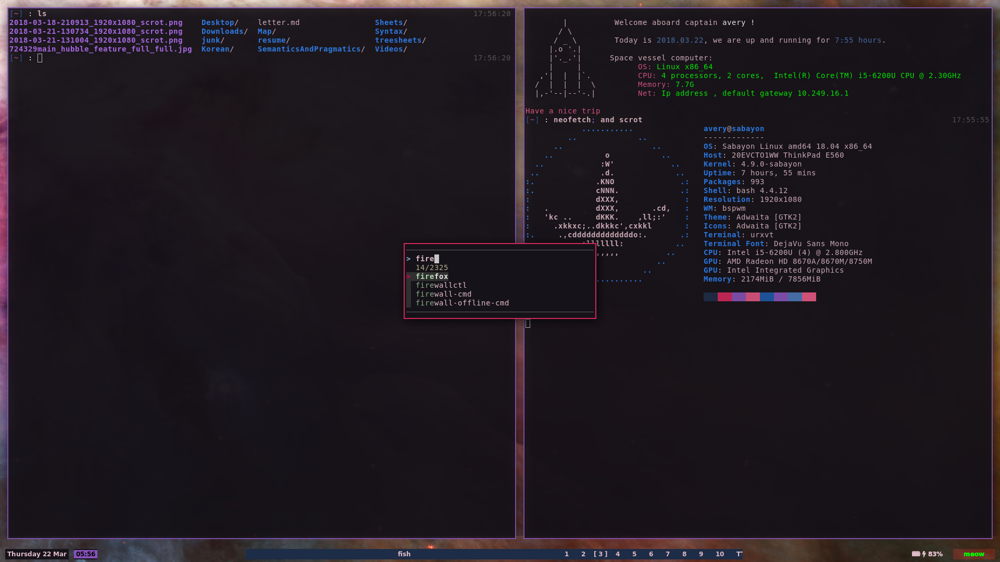
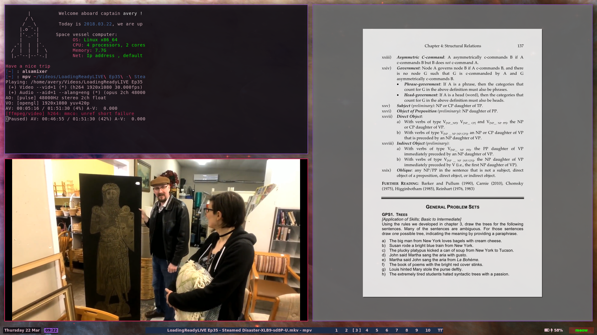

Avery's Wonderful Dotfiles :: Funky Space Edition
==========================

My current setup:

background source: [https://www.nasa.gov/sites/default/files/images/724329main_hubble_feature_full_full.jpg](https://www.nasa.gov/sites/default/files/images/724329main_hubble_feature_full_full.jpg)

The colorscheme is based off [FutureFunk by wulf](http://dotshare.it/dots/1526/)

Dependencies
------------

If you want everything, you'll need:

* bspwm
* sxhkd
* urxvt
* fish
* yabar
* dynamic-colors
* fzf
* xdotool
* lnch (for the fzf launcher, based on [this medium article](https://medium.com/njiuko/using-fzf-instead-of-dmenu-2780d184753f) (which also includes instructions on how to install it).

If you just want some partial stuff, feel free to use the dots for inspiration! And if you're new to this kind of thing and aren't sure what you're doing, get in touch, I'm happy to help.

Installation
------------

Copy all these files into your home directory (maintaining the directory structure here).

In addition, fish is using the `fishbone` theme, so get oh-my-fish and install that.

Description of each file
------------------------

* **.config/bspwm/bspwmrc** configuration for bspwm
* **.config/bspwm/autostart.sh** the file that runs when bspwm starts
* **.config/sxhkd/sxhkdrc** defines the keyboard shortcuts used
* **.config/yabar/yabar.conf** describes the yabar setup
* **.dynamic-colors/colorschemes** all the terminal colorschemes I converted from [dotshare.it](dotshare.it)
* **.Xresources** terminal (urxvt) colors and settings, mostly based on [FutureFunk](http://dotshare.it/dots/1526/). Also includes settings for the FuzzyLauncher appearance
* **.XCompose** my custom Compose Key sequences - includes IPA and greek letters, as well as a few others

### Fish Functions

* **archive** archives the entire contents of the current directory into a hidden folder.
* **cleanname** given a filename, echos the filename without the extension. _note: will break if the filename contains a dot_
* **convert_to_dynamic** converts (some) .XResources files into colorschemes for dynamic-colors
* **extract** automatically extracts zip files and tar files
* **junk** send files to a junk folder, rather than deleting them. Organises junk based on date-it-was-junked
* **list\_programs** list all programs fish knows about
* **q2map** a small utility for compiling quake 2 maps, not really portable at all
* **qwrtz** a simple timing utility. Assumes that the required files already exist.
* **uni\_wifi** kinda just personal? replaces NetworkManager with wpa_supplicant, so I can connect to my uni's more complicated wifi setup
* **yesno** give it a question, and it will prompt the user! if they say yes, it returns true, otherwise false
* **yt** a utility for downloading youtube videos without having to manually remember urls (requires youtube-dl)

### Binaries

* **bspformat.hs** formats the output of `bspc subscribe` to look prettier in the bar
* **fuzzy\_launch** the fzf based launcher

Previous Versions
-----------------

* Some really old files, I don't remember what they looked like

